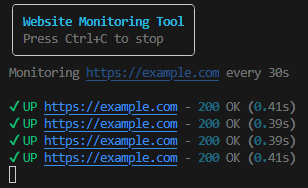

# Website Monitoring & Alert Tool

A clean, beginner‑friendly **Python CLI website monitoring tool** with a modern, visually pleasing terminal interface. Designed as a **portfolio project** and a practical utility for uptime checks.

---

## ✨ Features
- ✅ Monitor any website URL from the command line
- ⏱ Configurable check interval
- ⚠ Response‑time warnings
- ❌ Detects DNS failures, timeouts, and connection errors
- 🎨 Beautiful colored CLI output using **Rich**
- 🧩 Clean architecture, easy to extend

---

## 📸 Preview
> Example terminal output




---

## 🚀 Installation

```bash
git clone git@github.com:Kontaktligzda/Website-Monitoring-Alert-Tool.git
cd Website-Monitoring-Alert-Tool
pip install -r requirements.txt
```

---

## ▶ Usage

```bash
python main.py https://google.com
```

Optional flags:

```bash
--interval 30              # check every 30 seconds
--max-response-time 0.5    # warn if response > 500ms
```

Example:
```bash
python main.py https://google.com --interval 10 --max-response-time 0.3
```

Stop monitoring with **Ctrl + C**.

---

## 🧪 Tested Scenarios
- ✔ Normal website (200 OK)
- ❌ Non‑existent domain (DNS failure)
- ⏱ Slow responses
- ⚠ Network errors & retries

---

## 🛠 Tech Stack
- Python 3.9+
- requests
- rich
- argparse


## 📄 License
MIT
